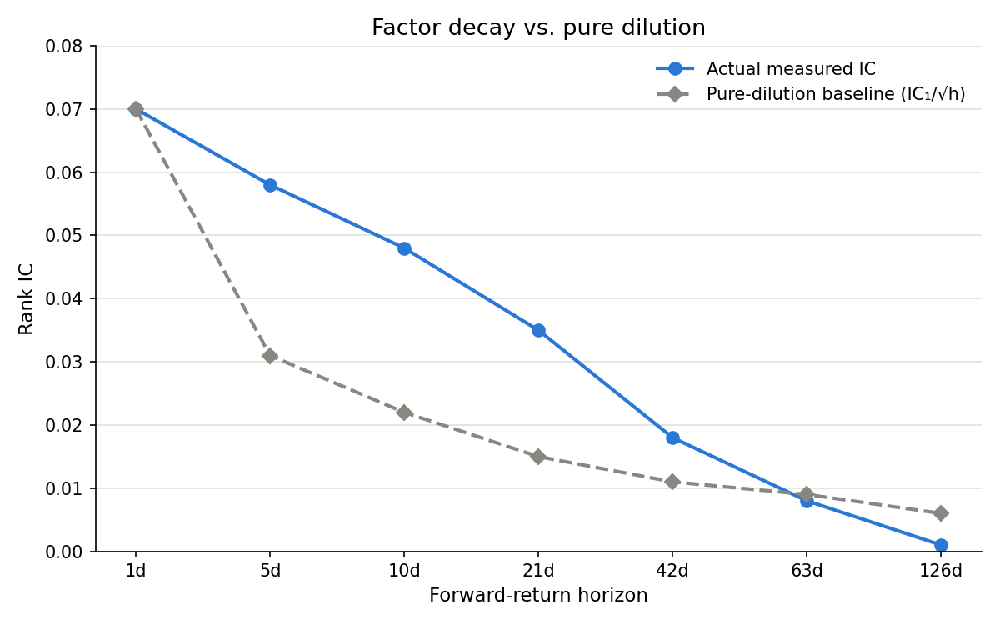

# P1-L7: Factor Decay and Turnover

## 1. Factor decay — what it actually is

**Plain-language version first.** A signal you compute today (say, a stock's sector-neutral z-score from momentum) is a snapshot of "who looks attractive right now." But "right now" has a shelf life. The information baked into that signal — some combination of price momentum, investor behavior, and fundamentals — gets absorbed into the stock price over time as other market participants notice the same thing, or as the underlying situation itself changes.

Think of it like a scouting report a Product Manager gets on a competitor's roadmap. The report is most valuable the day you get it. A week later, it's still somewhat useful — the competitor probably hasn't shipped everything yet. Six months later, it's nearly worthless — either the roadmap already played out, or it changed. **Factor decay is the measurement of exactly that shelf life, but for a quantitative signal instead of a scouting report.**

**Why this matters mechanically:** In P1-L6, you learned to compute Information Coefficient (IC) between a signal on date *t* and a **forward return** — the return over some window *after* date *t*. But you never pinned down *how far forward*. Should the forward return be 1 trading day later? A week? A month? The honest answer is: **it depends on how long the signal stays predictive**, and you find that out empirically by computing IC at multiple forward horizons and looking at the shape.

### 1.1 The decay curve

A **decay curve** is just rank IC plotted against forward-return horizon — nothing more exotic than that. You take the exact same signal values on the exact same date, and pair them against forward returns measured 1 day out, 5 days out, 10 days out, and so on, computing a separate rank IC for each horizon.

**Critical scope clarification: the decay curve is a cross-sectional statistic, not a per-stock statistic.** Rank IC (per P1-L6) is a correlation, and correlation is undefined for a single data point — there is nothing to correlate a single stock's z-score against. IC is computed across the *whole universe* on a given date: on date t, every stock in the universe gets a signal value and a forward return at some horizon, and one correlation number is computed across all of those (signal, forward-return) pairs for that date. That single-date IC is then averaged across many historical dates to get one IC value per horizon — and repeating that across horizons produces the decay curve. So a decay-curve point like "IC = 0.035 at the 21-day horizon" is a statement about how the *factor as a whole* (e.g., sector-neutral momentum, applied to this universe) behaves on average across many stocks and many dates — not a statement about any single ticker's individual timeline. What genuinely is per-stock is the raw signal value itself (e.g., NVDA's z-score on a given date); IC, the decay curve, half-life, and turnover are all cross-sectional/aggregate properties of the signal's behavior, not properties of individual stocks. This also means the decay curve is specific to the (factor, universe, time period) combination being measured — a different universe or a different factor would very plausibly produce a differently shaped curve; the numbers below are illustrative for teaching, not a general fact about momentum.

**Reminder: what "the signal" is, and how it's computed** (full detail in P1-L4). "Signal" is not the raw momentum number — it's that raw number after being cleaned up and made comparable across every stock in the universe, via this three-step pipeline:

| Step | What happens | Example (illustrative) |
|---|---|---|
| 1. Raw factor | Compute 12-month-minus-1-month momentum for each stock (skip the most recent month to avoid short-term reversal noise) | NVDA raw momentum = 95% |
| 2. Winsorize | Cap extreme values at the 1st/99th percentile across the universe, so one outlier doesn't distort everything downstream | NVDA's 95% might get capped to, say, 25% if it's an extreme outlier |
| 3. Sector-neutral z-score | Within each Global Industry Classification Standard (GICS) sector group separately, compute z = (value − sector mean) / sector standard deviation | NVDA's z-score computed only against other Tech-sector momentum values, not the whole universe |

The output of step 3 — the sector-neutral z-score — is "the signal." Every time the mechanics table below refers to "compute the signal for every stock," it means running this full three-step pipeline (raw factor → winsorize → sector-neutral z-score) for each stock, not just pulling a raw momentum number.

**The exact mechanics, step by step**, for how one point on the decay curve actually gets computed:

| Step | What happens |
|---|---|
| 1 | On a single date *t*, compute the sector-neutral momentum z-score for **every stock in the universe** (e.g., all 100 NASDAQ-100 names) — via the three-step signal pipeline (raw factor → winsorize → sector-neutral z-score) reminded above |
| 2 | Pick a forward horizon (say, 21 days) and compute **every stock's** forward return over that horizon |
| 3 | Compute **one** rank correlation across all ~100 (signal, forward-return) pairs on that date — that's a single IC number *for that date* |
| 4 | Repeat steps 1-3 across many historical dates (many monthly rebalances, say) |
| 5 | Average the IC across all those dates → one IC number *for that horizon* |
| 6 | Repeat 1-5 at each horizon (1-day, 1-week, 1-month, etc.) → the decay curve |

**Worked numerical example.** Suppose (hypothetically, for teaching purposes — real decay shapes must be measured empirically on your actual signal and universe, not assumed) you compute rank IC for a momentum signal at seven different forward horizons, averaged across many historical rebalance dates:

| Horizon | Trading days ahead | Rank IC |
|---|---|---|
| 1 day | 1 | 0.070 |
| 1 week | 5 | 0.058 |
| 2 weeks | 10 | 0.048 |
| **1 month** | **21** | **0.035** |
| 2 months | 42 | 0.018 |
| 3 months | 63 | 0.008 |
| 6 months | 126 | 0.001 |

Reading this table: the signal is most predictive almost immediately after it's computed (IC = 0.070 at 1 day), and the predictive power steadily erodes as the horizon lengthens, until by 6 months it's essentially indistinguishable from noise (IC = 0.001, near zero). This monotonic decline is the classic decay pattern.

**Important caveat, stated plainly:** not every factor decays monotonically. Some factors (value is the textbook example) can show weak or even negative near-term IC before becoming more predictive at longer horizons, because the mechanism (mean reversion to fair value) plays out slowly. The shape of the curve is an empirical question specific to *this* signal, *this* universe, and *this* time period — never assume a shape, measure it.

### 1.2 Half-life — putting a single number on the curve

**Intuition first.** "Half-life" is borrowed directly from radioactive decay: the time it takes for a quantity to fall to half its starting value. Applied here: **the half-life of a signal is the forward-return horizon at which its IC has dropped to half of its near-immediate (day-1) value.** It's a convenient single number that answers "roughly how long do I have before this signal is only half as useful?" — useful for a plain-English conversation with a portfolio manager who doesn't want to look at a seven-row table.

**Worked example, using the table above:**

- Day-1 IC = 0.070 (treat this as the reference "full strength" value)
- Half of that = 0.035
- Scanning the table, IC = 0.035 occurs exactly at the **1-month (21 trading day)** horizon

So this signal's half-life ≈ **21 trading days, roughly one calendar month.**

This single number is doing a lot of work: it's telling you that if you want to capture close to the full predictive value of this signal, you need to act (rebalance) on a timescale meaningfully shorter than a month — and if you rebalance much slower than that, you're trading on a signal that's already lost more than half its punch.

### 1.3 A critical clarification: "21-day IC" means correlation with the *cumulative* 21-day return, not the return on day 21 alone

This point is easy to misread and worth stating precisely, because the natural first reading of the decay table — "the signal is still valid at day 21" — is not quite what the number says.

**What forward return at a given horizon actually is.** When the decay table reports IC at the "1-month (21 day)" horizon, the forward return being correlated against the signal is the **cumulative return from day *t* through day *t*+21 added together** — not the single day's return that happens to fall on day 21. So the question "if 1-day IC is 0.070, how can the signal be predictive out to day 21?" is really asking about two different things: predictive power on a single distant day vs. predictive power over the whole accumulated month. The decay curve only speaks to the second.

**Why IC shrinks with horizon even from pure dilution, not real ongoing predictive power.** Suppose, as an extreme thought experiment, that *all* of a signal's true predictive power happened on day 1, and every day after that was pure noise, completely unrelated to the signal. The 21-day cumulative return is just day-1 return plus 20 more days of unrelated noise stacked on top. Correlating the signal against that growing sum will **mechanically shrink the measured IC**, purely because you're diluting one real relationship with more and more unrelated variance — even though nothing about the signal's "strength" has changed after day 1. Under a simplifying assumption that daily returns are roughly independent and similarly sized, correlation shrinks approximately in proportion to 1/√(number of days added):

Pure-dilution prediction for the 21-day IC, if the signal only ever predicted day 1: IC(21 days) ≈ IC(1 day) / √21 = 0.070 / 4.58 ≈ **0.015**

**Comparing that prediction to what was actually measured in the worked table (IC = 0.035 at 21 days)** is the key diagnostic: 0.035 is more than double the pure-dilution estimate of 0.015. That gap tells you the signal is not just a one-day effect getting diluted by noise — it is still contributing some real, if weaker, predictive power to returns on days 2 through 21, at a declining rate. That is what "the signal decays" actually means: not "still fully valid at day 21," and not "only valid on day 1," but "still leaking real, detectable information into cumulative returns for a few weeks, at a shrinking rate, on top of whatever noise dilution alone would produce."

**Correct reading of "half-life ≈ 21 days," restated precisely:** it means the cumulative 21-day return still carries a statistically detectable, non-trivial trace of the signal's predictive power — roughly half the correlation strength you'd measure one day out — not that each individual day inside that window is independently half as predictive as day 1. The earliest days in the window are doing most of the predictive work; the later days mostly dilute the correlation (some inevitably, from pure noise-stacking, and some because the signal's true edge is genuinely fading) without erasing it entirely by day 21.

**Why this matters for the monthly-rebalance decision:** the justification is not "the signal is still just as strong after a month." It's narrower and more defensible: waiting a month to rebalance still captures a return stream carrying real, detectable signal content — enough to be worth trading on at a cost-justified frequency — rather than needing to chase a fast-fading effect daily at much higher turnover cost for comparatively little additional signal captured.

### 1.4 Decay table with the pure-dilution baseline added

The decay table from Section 1.1 is repeated here with a third column added: the pure-dilution prediction, i.e. what the IC at each horizon *would* be if the signal's entire predictive effect happened on day 1 and every day after that were pure, unrelated noise. This column is computed as IC(1 day) / √(number of trading days), following directly from the dilution math worked through in Section 1.3.

| Horizon | Trading days ahead | Actual measured rank IC | Pure-dilution prediction (IC₁ / √h) | Excess over pure dilution |
|---|---|---|---|---|
| 1 day | 1 | 0.070 | 0.070 | 0.000 |
| 1 week | 5 | 0.058 | 0.031 | 0.027 |
| 2 weeks | 10 | 0.048 | 0.022 | 0.026 |
| **1 month** | **21** | **0.035** | **0.015** | **0.020** |
| 2 months | 42 | 0.018 | 0.011 | 0.007 |
| 3 months | 63 | 0.008 | 0.009 | −0.001 |
| 6 months | 126 | 0.001 | 0.006 | −0.005 |

Reading the "excess over pure dilution" column: it is positive and meaningfully large through roughly the 1-2 month mark (0.020 to 0.027), meaning real predictive content beyond a simple day-1 effect is still present in that window. By 3 months, the excess turns essentially zero or slightly negative (within the noise of an illustrative example) — a rough empirical signal that whatever real edge the factor had has, by that point, been fully absorbed into prices, and the actual measured IC is no longer distinguishable from what noise dilution alone would produce.

### 1.5 Visualizing the decay curve against the dilution baseline

The chart below plots both series from the table above on the same axes — forward-return horizon on the x-axis, rank IC on the y-axis — so the gap between "actual decay" and "pure dilution" is visible directly, rather than having to compare numbers column by column.

*(Note: this image file, `P1_L7_decay_chart.png`, must be kept in the same folder as this notes file for the image to display when viewing the `.md` file locally — e.g. in VS Code's markdown preview, Obsidian, or a plain file browser. It was provided alongside this file as a separate download.)*

Reading the chart: the blue (solid) line sits visibly above the gray (dashed) line from 1 day through roughly the 42-day mark — that gap is the real, incremental predictive content the signal is still contributing beyond what dilution alone would produce. By the 63-126 day range, the two lines converge, consistent with the "excess over pure dilution" column above turning to roughly zero — the signal's real edge has been fully absorbed by that point, and what's left is indistinguishable from noise.

## 2. Turnover — what it actually is

**Plain-language version first.** Turnover measures **how much of your portfolio you have to buy and sell just to keep it aligned with an updated signal.** Every time you rebalance — recompute the signal, re-rank stocks, rebuild the quintile buckets — some stocks that used to be in your "buy" bucket fall out, and new ones enter. Turnover is the size of that churn, expressed as a percentage of the portfolio.

Analogy from your world: think of turnover like team reassignments after every quarterly reorg. If the org chart barely changes quarter to quarter, "turnover" (people moving desks) is low. If leadership reshuffles the whole structure every quarter, turnover is high — and every reshuffle has a real cost (onboarding time, lost context, disruption), even if each individual move seems reasonable in isolation. Portfolio turnover works the same way: every trade has a cost (covered in depth in P1-L9), so more turnover directly means more cost, whether or not any single trade was a good idea.

### 2.1 Turnover formula and worked example

**One-way turnover** for a set of positions, from one rebalance to the next:

Turnover = (Σ |weight_new − weight_old| across all names) / 2

The division by 2 exists because every dollar that leaves one position becomes a dollar that enters another — counting both the "sold" side and the "bought" side would double-count the same trade. Dividing by 2 gives you the actual fraction of the portfolio that got traded.

**Worked example**, reusing the 20-stock quintile-bucketing setup from P1-L5 (top quintile = 4 stocks, equal-weighted at 25% each, long side only):

**Month 1 top quintile:** AAA, BBB, CCC, DDD (each 25%)

**Month 2:** the signal has updated. AAA, BBB, CCC remain in the top quintile. DDD has fallen out (its momentum faded); EEE has risen into the top quintile.

| Ticker | Weight (Month 1) | Weight (Month 2) | \|Δ weight\| |
|---|---|---|---|
| AAA | 25% | 25% | 0% |
| BBB | 25% | 25% | 0% |
| CCC | 25% | 25% | 0% |
| DDD | 25% | 0% | 25% |
| EEE | 0% | 25% | 25% |
| **Sum** | | | **50%** |

Turnover = 50% / 2 = **25% one-way turnover** for this rebalance (long side only).

For a long-short portfolio, you'd run the identical calculation separately on the bottom (short) quintile and combine — if the bottom quintile also churned one stock out and one in, you'd add another 25%, giving 50% total one-way turnover across both legs for that rebalance.

### 2.2 The turnover-cost relationship

**Intuition first.** Every unit of turnover costs money — bid-ask spread, market impact, commissions (the specific cost components get full treatment in P1-L9). For now, treat "cost per unit of turnover" as a single blended number, expressed in **basis points (bps)** — a basis point is 1/100th of a percent (100 bps = 1%). This is standard finance shorthand for talking about small percentages without a lot of leading zeros.

**Worked example**, continuing the 25% one-way turnover above, assuming a blended transaction cost of **5 bps per unit of one-way turnover traded** (a placeholder assumption — the real number depends on stock liquidity, order size, and market conditions, covered in P1-L9):

Cost per rebalance = turnover × cost rate = 25% × 5 bps = **1.25 bps drag per rebalancing event**

Now compare rebalancing frequencies. Suppose (illustratively) turnover per rebalance stays roughly similar regardless of frequency, but the *number* of rebalancing events per year changes:

| Rebalance frequency | Rebalances per year | Turnover per rebalance (illustrative) | Annual cost drag |
|---|---|---|---|
| Monthly | 12 | 25% | 12 × 1.25 bps = 15 bps/year |
| Weekly | 52 | 25% | 52 × 1.25 bps = 65 bps/year |
| Daily | ~252 | 25% | 252 × 1.25 bps = 315 bps/year |

This table is the whole point of the lesson in one place: **rebalancing more often doesn't just cost proportionally more — because both the number of events *and* (often) the turnover per event can rise together, cost can scale faster than the extra predictive power you're capturing.** Going from monthly to daily rebalancing multiplies your annual cost drag by over 20x, and per the decay curve above, most of that signal's value was already captured within the first few days — you'd be paying enormously more to chase decay that's already mostly happened.

## 3. Putting decay and turnover together — the rebalancing frequency decision

This is where P1-L5's deferred question ("how often do you rebalance?") finally gets answered, and it's answered by combining the two concepts above, not by picking a number arbitrarily.

**The trade-off, stated plainly:**
- Rebalance **too infrequently** relative to the signal's half-life, and you're holding stale positions — you're trading on a signal that's already decayed most of its value away by the time you act again.
- Rebalance **too frequently** relative to the signal's half-life, and turnover (and the cost that comes with it) rises faster than the extra predictive value you capture — you're paying to chase noise, not signal.

**The decision rule:** rebalance on a timescale close to the signal's half-life, not much faster and not much slower. Using the worked half-life of ~21 trading days (1 month) above: monthly rebalancing sits almost exactly at the half-life. It captures most of the signal's predictive value (since the IC at 1 month, 0.035, is still meaningfully above zero — see the decay table) while avoiding the steep, roughly-linear-in-frequency cost escalation shown in the turnover table.

## 4. Resolving the carried-forward items

Three open items from P1-L5 and P1-L6 get resolved by this lesson. All three are now locked decisions for Project 1.

### 4.1 Rebalancing frequency (deferred from P1-L5)

**Decision: monthly rebalancing**, for all of Project 1's factor backtests, portfolio construction, and metrics calculation. Rationale: it sits close to the illustrative half-life measured above, balances capturing signal value against turnover cost, and matches standard academic/industry convention for cross-sectional equity factor research (most published factor studies, including Fama-French, rebalance monthly) — making Project 1's results directly comparable to published benchmarks.

### 4.2 Forward-return window for IC calculation (deferred from P1-L6)

**Decision: 1-month (21 trading day) forward return** as the primary window for all rank IC, Pearson IC, hit rate, and Information Ratio calculations in Project 1. Shorter windows (1-day, 1-week) will be retained as **diagnostic-only** decay-curve measurements (per this lesson) but not used as the headline evaluation metric, since the portfolio itself rebalances monthly — the forward window should match the rebalancing frequency, for the reason covered next.

### 4.3 Overlapping forward-return windows / autocorrelation (deferred from P1-L6)

**The problem, restated plainly:** if you rebalance daily but measure a 21-day forward return each time, then Monday's 21-day forward return and Tuesday's 21-day forward return share 20 of their 21 days in common — they're almost the same number wearing a different label. Treating each day's IC as an independent data point in the Information Ratio and time-series t-statistic calculation (t = IR × √T) would badly overstate how much genuine independent evidence you have, because T (the number of periods) would be counted as if every day were a fresh, unrelated observation.

**Why Project 1 sidesteps this cleanly:** because the rebalancing frequency (monthly) now matches the forward-return window (1-month), **consecutive IC observations are non-overlapping by construction** — each month's forward return window ends before the next one begins. This means the IC time series used for the Information Ratio and its t-statistic can be treated as approximately independent observations without needing a separate statistical correction.

**When this wouldn't be enough (noted for completeness, not needed for Project 1 as scoped):** if a future project needed daily rebalancing with a longer forward window, the standard fix is an **autocorrelation-adjusted standard error** (e.g., Newey-West), which explicitly accounts for the correlation between overlapping observations rather than pretending they're independent. Project 1 does not need this machinery given the monthly/monthly match, but it's worth knowing the term exists if you encounter overlapping-window backtests in the wild (they're common, and un-adjusted ones are a frequent, quiet source of overstated statistical significance in factor research — a good thing to be able to spot in an interview or when reviewing someone else's backtest).

## 5. Summary — full decision set from this lesson

| Question | Decision | Why |
|---|---|---|
| How is decay measured? | Rank IC computed at multiple forward horizons (1-day through 6-month), plotted as a decay curve | Empirical measurement, not assumption — shape varies by factor |
| Single-number decay summary | Half-life = horizon where IC falls to half its day-1 value | Convenient shorthand for stakeholder conversations |
| Rebalancing frequency | **Monthly** | Matches illustrative half-life (~21 trading days); matches academic convention |
| Primary IC forward-return window | **1-month (21 trading days)** | Matches rebalancing frequency, avoids overlap problem, still captures meaningful signal per decay curve |
| Overlapping-window statistical dependence | **Not an issue for Project 1** — resolved by matching rebalance frequency to forward window | No Newey-West-style adjustment needed given this match |
