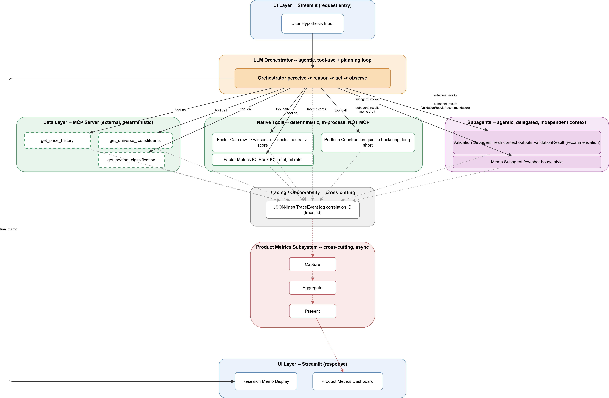

# P1-Arch-1: System Design

**Phase:** Phase 2 — Architecture & Design
**Status:** Complete — 2026-07-20
**Deliverable:** Architecture diagram (this lesson) + `docs/architecture/project_01_factor_research.md`

---

## 1. What a system architecture diagram is, and why it comes before any code

**Intuition.** Think about the difference between an Investment Policy Statement (IPS) and a trade blotter. The trade blotter records what happened, one line at a time, after the fact. The IPS is written *before* any trade happens — it defines the mandate, the boundaries, who's allowed to do what, and how the pieces (asset allocation, risk limits, rebalancing rules) relate to each other. You'd never let a portfolio manager (PM) start trading a fund with no IPS and "figure out the boundaries as we go" — not because the trades would be wrong on day one, but because by month six nobody can say who's accountable for what, and untangling it costs far more than writing the IPS would have.

A system architecture diagram is the IPS for a codebase. It's drawn *before* Phase 3 (build sprints) for the same reason: once you're 200 lines into a Streamlit app with the orchestrator, the validator, and the memo writer all tangled together in one file, restructuring is expensive. Drawing the boundaries first is cheap.

**What the diagram actually needs to answer**, concretely, for every box:
1. What are the distinct pieces (components)?
2. What does each piece own — what's its one job?
3. Who calls whom, and in what direction?
4. What gets passed across each boundary?

If you can't answer all four for a given box, the box isn't done yet.

---

## 2. The organizing lens: deterministic vs. agentic components

Before listing P1's components, one distinction does most of the organizing work, because it drives testing strategy, cost, latency, and reliability engineering differently for each side.

| | **Deterministic component** | **Agentic (LLM-driven) component** |
|---|---|---|
| **What it is** | Regular Python code. Same input → same output, every time. | An LLM call (or loop of calls) that reasons and decides. Same input → *usually similar*, not guaranteed identical, output. |
| **Analogy** | A settlement system: given a trade ticket, it always produces the same settlement instructions. No judgment involved. | A junior research analyst: given the same assignment twice, gives you two answers that are both reasonable but not identical. |
| **How you test it** | Unit tests. Assert exact output for a given input. | Evals (per P1-LE1: model evals vs. system evals). You test *distributions of behavior*, not exact strings. |
| **Cost/latency** | Near-zero, milliseconds. | Real dollars per call, seconds of latency. |
| **P1 examples** | Factor calc, portfolio construction, factor metrics (IC/rank IC/t-stat), the yfinance MCP tools | The orchestrator, the validation subagent, the memo subagent |

This distinction is why the architecture diagram needs two visually distinct box types, not one uniform "component" shape. A junior engineer reading the diagram should be able to tell at a glance which boxes need `pytest` and which need an eval harness.

---

## 3. Component-by-component walkthrough

| Component | Job (one sentence) | Type | Invocation mechanism |
|---|---|---|---|
| **UI (Streamlit)** | Takes the user's hypothesis, shows the memo and product metrics | Neither — entry/exit point | User interaction |
| **LLM Orchestrator** | Runs the perceive→reason→act→observe loop; decides what to call, in what order | Agentic | Invoked by the UI on each user request |
| **Data layer (yfinance MCP server)** | Serves price history, universe constituents, sector classifications | Deterministic (external data source) | Called by the orchestrator via MCP tool-use protocol |
| **Factor calc module** | Raw factor → winsorize → sector-neutral z-score | Deterministic | Called by the orchestrator as a native tool |
| **Portfolio construction module** | Quintile bucketing, long-short/long-only construction | Deterministic | Called by the orchestrator as a native tool |
| **Factor metrics module** | Information Coefficient (IC), Rank IC, t-statistic, hit rate | Deterministic | Called by the orchestrator as a native tool |
| **Validation subagent** | Independent methodology review; flags p-hacking, look-ahead bias, etc. | Agentic | Delegated to by the orchestrator, **fresh context** |
| **Memo subagent** | Writes the final research memo in house style | Agentic | Delegated to by the orchestrator |
| **Tracing/observability layer** | Records every `perceive`/`reason`/`act`/`observe`/`escalation`/`subagent_invocation`/`subagent_result` event | Deterministic, cross-cutting | Instruments *every other component* — not called sequentially |
| **Product metrics subsystem** | Capture → aggregate → present usage/trust/cost metrics for the PM-facing dashboard | Deterministic, cross-cutting | Fed by the tracing layer, not by the research pipeline directly |

### 3a. Tracing vs. Product Metrics — two different subsystems, not one

It's tempting to lump "metrics" into a single box, but they answer different questions for different audiences and sit at different points in the pipeline.

| | **Tracing / Observability** (P1-LA12) | **Product Metrics** (P1-LE2) |
|---|---|---|
| **Question it answers** | "What did the agent actually do, step by step, and why did it fail?" | "Is this product working — adoption, trust, cost-of-quality?" |
| **Audience** | The builder, debugging an agent loop | The builder wearing a PM hat, reviewing whether the product earns its keep |
| **Granularity** | Every single event (`perceive`, `reason`, `act`, ...) | Aggregated — daily/session rollups |
| **Storage** | JSON-lines, correlation-ID threaded, raw | Three-layer: capture (raw events) → aggregate (summary tables) → present (dashboard) — Online Transaction Processing (OLTP) vs. Online Analytical Processing (OLAP) separation, per P1-LE2's locked design |
| **Relationship** | Upstream — the *source* of the data | Downstream — *consumes* trace events and rolls them up |

In the diagram, the product metrics subsystem does not get its own arrows into the orchestrator or subagents — it gets one arrow **from the tracing layer**. That is the entire point of the capture/aggregate/present separation locked in P1-LE2: the dashboard never queries raw operational logs directly, and metrics writes stay off the critical (synchronous) request path.

### 3b. Two different "metrics" inside the research pipeline itself

Do not confuse the **factor metrics module** (IC, rank IC, t-stat, hit rate — a step inside the research pipeline itself) with the **product metrics subsystem** above. Same word, two unrelated things. The factor metrics module is deterministic research math, invoked synchronously as part of answering the user's question. The product metrics subsystem is instrumentation about how the *product* is being used, computed asynchronously off trace events. They are kept as two separate boxes in the diagram for exactly this reason.

---

## 4. Design decision (locked): MCP, or a plain local tool?

Four components could theoretically be MCP servers: the data layer (yfinance), factor calc, portfolio construction, and factor metrics. Should all four be MCP servers, or just one?

**What Model Context Protocol (MCP) is actually for:** standardizing access to an *external resource* — something that could reasonably be reused by a different agent, application, or team, and that benefits from a stable, documented, transport-independent interface. Anthropic's own reference MCP servers connect to external systems with real API surfaces — Slack, Google Drive, GitHub.

**What factor calc, portfolio construction, and factor metrics actually are:** pure Python functions, running in the same process as the orchestrator, with no external resource behind them. Nobody outside this one agent will ever connect to a "sector-neutral z-score server."

| Component | MCP server? | Reasoning |
|---|---|---|
| yfinance data layer | **Yes** | External data resource; genuinely reusable across future projects (Project 2 swaps it for Polygon.io — same *pattern*, different server); the standard MCP use case |
| Factor calc | **No — native tool** | Pure in-process computation, no external resource, no reuse case outside this one agent |
| Portfolio construction | **No — native tool** | Same reasoning |
| Factor metrics | **No — native tool** | Same reasoning |

**Decision locked (2026-07-20):** only the data layer runs as an MCP server. Factor calc, portfolio construction, and factor metrics are exposed to the orchestrator as native tool-use functions — the same tool-calling *schema* Claude sees, implemented as direct Python function calls in application code rather than served over the MCP client-server protocol. This avoids running three unnecessary local server processes for zero reuse benefit, and it is consistent with why Project 2 upgrading its data source to Polygon.io will be a clean swap — only the data layer sits behind the MCP boundary in the first place.

Interview framing this decision earns: *"I only put things behind MCP that were genuinely external resources — everything that was pure computation stayed as a native tool, because MCP's value is standardizing access to something worth standardizing, not adding transport overhead to a function call."*

---

## 5. Orchestrator vs. subagent: why validator and memo-writer are not just more tools

A **tool** is for a well-defined, narrow, stateless operation (compute this z-score, fetch this price series). A **subagent** is for when a genuinely independent reasoning process is needed — different context, possibly a different (stronger) model, a different persona.

The validator is a subagent, not a tool, because **it needs a fresh context.** If it inherited the orchestrator's reasoning trail, it would be reviewing its own homework with the orchestrator's assumptions already baked in — the "confused deputy" risk from P1-LA10, which defeats the point of independent review. This is a qualitative argument about independence of judgment, not just a token-cost argument, and it was established in P1-LA9.

The memo writer is a subagent because it needs a distinct persona and house style (few-shot examples tuned for tone, per P1-LA16/LA17) that would clutter the orchestrator's own prompt if merged in.

**Governance detail reflected in the diagram:** the arrow from the validator back to the orchestrator is labeled `subagent_result: ValidationResult (recommendation)` — not `(decision)`. Per P1-LA11, `ValidationResult.passed: true` is a recommendation to a human accountable party, not a final gate. The orchestrator — and ultimately the human operator — still decides what happens next. Drawing that arrow as an unconditional pass/fail gate would misrepresent the human-in-the-loop governance model already locked for this project.

---

## 6. Worked example: one request traced through every component

Scenario: user submits "Test momentum on NASDAQ-100" (same scenario P1-Arch-2, the data-flow lesson, will expand on in full sequence-diagram detail).

| Step | Component | What happens | What crosses the boundary |
|---|---|---|---|
| 1 | UI → Orchestrator | User types the hypothesis | Natural-language hypothesis string |
| 2 | Orchestrator (reason) | Parses intent, plans: need universe, prices, factor calc, portfolio construction, metrics | Internal reasoning, logged as a `reason` trace event |
| 3 | Orchestrator → MCP data layer | Calls `get_universe_constituents`, `get_price_history` | Ticker list, price DataFrames |
| 4 | Orchestrator → Factor calc (native tool) | Calls factor calc with the momentum spec | Raw factor → winsorized → sector-neutral z-scores |
| 5 | Orchestrator → Portfolio construction (native tool) | Quintile bucketing, long-short weights | Bucket assignments and weights |
| 6 | Orchestrator → Factor metrics (native tool) | IC, rank IC, t-stat, hit rate | Metrics summary object |
| 7 | Orchestrator → Validation subagent | Delegates full analysis for review, **fresh context** | Analysis summary in; `ValidationResult` (recommendation) out |
| 8 | Orchestrator (escalation check) | If the validator flags something above the Consequence × Reversibility × Confidence-gap threshold (≥12, from P1-LA11), escalates rather than proceeding silently | `escalation` trace event |
| 9 | Orchestrator → Memo subagent | Delegates memo writing | Analysis + validation result in; memo draft out |
| 10 | Orchestrator → UI | Returns the final memo | Formatted memo |
| — | Every step above → Tracing layer | Every step emits a trace event under a shared `trace_id` | `perceive` / `reason` / `act` / `observe` / `escalation` / `subagent_invocation` / `subagent_result` events |
| — | Tracing layer → Product metrics subsystem | Trace events feed capture → aggregate → present | Rolled-up usage/trust/cost metrics, computed asynchronously, off the critical path |

Step 9 is why the memo subagent takes the validation result as an input, not just the raw analysis — the memo has to be able to state honestly whether the analysis passed methodology review, or flag a caveat if it did not. The last row is why the product metrics dashboard box never appears on the *synchronous* request path — it is fed asynchronously off tracing, and never blocks the user's actual request, per the async-metrics-writes principle already locked for this project.

---

## 7. The diagram

**Canonical source: `project_01_factor_research.drawio`** (draw.io/diagrams.net XML). The PNG above is the actual export from the draw.io app (File → Export as → PNG), not a re-derived render — a Claude-side reconstruction was tried in an earlier pass and was visibly lower quality, so the direct export is now the standard going forward. If the architecture changes again, edit the `.drawio` file (open in app.diagrams.net, keep it uncompressed on export/save so it stays plain-text-readable), export a fresh PNG from within the app, and send both files back.

There is no Mermaid or other secondary diagram format — the `.drawio` file and its PNG export are the only representations of this architecture. If the diagram needs to be read or reasoned about programmatically in a future session, parse `project_01_factor_research.drawio` directly (it's plain XML: `<mxCell vertex="1">` elements are nodes with `value`/`style`/`<mxGeometry>`; `<mxCell edge="1">` elements are connectors with `source`/`target`/`value`) rather than relying on a text-based diagram description.

**Note on the legend:** an earlier draft PNG included a separate legend box explaining the dashed-vs-solid MCP distinction. That box was dropped to reduce clutter — the distinction itself is still encoded directly on the nodes (MCP tool boxes: dashed border; native tool boxes: solid border), just without a standalone key. Worth restating in prose wherever this diagram is presented without this notes file alongside it.

**Note on subagent edges:** the diagram draws one arrow per subagent (orchestrator → subagent) carrying a combined label — invocation and result together (e.g. "subagent_invoke / subagent_result: ValidationResult (recommendation)") — rather than two separate arrows (an invocation edge out, a result edge back). This is a visual simplification the underlying control flow is still a round trip; the validator genuinely does return a result to the orchestrator, and that result is still labeled a recommendation, not a decision, per P1-LA11. If presenting this diagram standalone (e.g. in an interview), say the round trip out loud rather than relying on the single arrow to convey it.

**Reading the diagram:** the orchestrator is a hub, not a pipeline stage — nearly everything routes through it (hub-and-spoke, not a straight line). The tracing layer sits apart from the request-path boxes on purpose: it is not a step *in* the sequence, it is a cross-cutting instrument attached to every other box. The product metrics subsystem hangs entirely off tracing, never off the research pipeline directly — the OLTP/OLAP separation from P1-LE2, made visible as a shape rather than only a sentence in notes.

---

## Open items carried forward

- Whether the orchestrator's tool-use loop is implemented via the Claude Agent SDK or a hand-rolled loop is a build-sprint-level decision, not an architecture-diagram-level one — deferred, to be resolved when P1-Build reaches the orchestrator.
- P1-Arch-2 (Data flow design) will expand the "one request traced through every component" table above into a full sequence diagram with the specific data shapes (DataFrame columns, Pydantic field names) passed at each boundary.
- P1-Arch-3 (Orchestrator + subagent design) will go deeper on what exactly gets passed into the validator and memo subagents' fresh contexts, and how failures propagate back up (e.g., what happens if the validator itself errors, or if an MCP tool call fails mid-loop).

## Deliverables

- This notes file (`P1_Arch1_System_Design.md`)
- `docs/architecture/project_01_factor_research.md` — the architecture write-up, to be placed at that path in the repo
- `docs/architecture/project_01_factor_research.drawio` — the canonical, editable diagram source (draw.io/diagrams.net XML)
- `docs/architecture/P1_Arch1_architecture_diagram.png` — rendered image, generated directly from the `.drawio` file, embedded in both markdown files above
- Updated `CONTEXT.md`
- Updated `curriculum.md`

**Estimated time spent:** matches curriculum estimate of 2-3 hours (not separately logged; log actual hours in CONTEXT.md's Hours-Logged Tracker if tracking precisely going forward).
