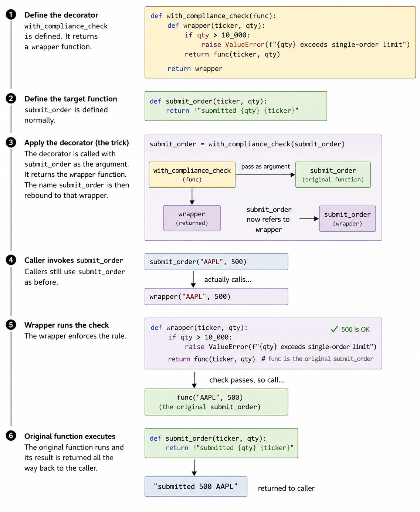

# P1-Build-0: Python Foundations for the Build Phase

**Completed:** 2026-07-30
**Phase:** 3 (Build Sprints) — prerequisite, gates P1-Build-1
**Estimated time:** 5-7 hours
**Prior name:** originally scoped as "Async I/O fundamentals"; broadened after an audit of the P1-Arch-4 locked skeleton against all thirteen P1 build sprints surfaced six further untaught Python prerequisites.

---

## 0. Why this lesson exists, and its organizing idea

Phase 1 (32 concept lessons) covered finance, agentic Artificial Intelligence (AI), backtesting rigor, and evaluations. It covered **no Python language engineering**. Phase 2 (Architecture & Design) then locked a full function-signature skeleton that uses seven Python constructs never taught: `async def`, decorators, custom exception classes, context managers, package imports, pytest, and environment/secret management.

This lesson closes that gap. It is a prerequisite for P1-Build-1, not a standalone concept lesson — hence the `Build-0` numbering, following the precedent of `P1-Arch-0: Tooling setup`.

### Naming correction logged

An earlier proposal in this session named this lesson `P1-L33`. That was wrong on two counts and is recorded here as a caught error:

- The `P1-L` prefix denotes the **Finance track specifically**, which runs `P1-L1` through `P1-L10` and is closed.
- The number 33 came from incrementing "32/32 concept lessons complete." But 32 is a **sum across four separately-prefixed tracks** (Finance 10 + AI/Agentic 17 + Backtesting Rigor 3 + Evaluations 2), not a flat sequence. There is no 33rd position to occupy.

Corrected to `P1-Build-0`, which places the lesson in Phase 3 where it belongs and encodes its gating relationship to P1-Build-1 in the number itself.

### The organizing idea: everything here is sugar

Every construct in this lesson is **syntactic sugar** — a compact notation for something writable longhand. `with` is sugar. `@decorator` is sugar. `async`/`await` is sugar.

Beginners cargo-cult these constructs because they learn the notation and never see the machine underneath, so they cannot reason about behaviour when it misbehaves. This lesson therefore follows the established **manual-first teaching rule**: for each construct, the longhand version comes first, then the sugar, then the demonstration that they are the same thing. Same principle as hand-building the tool-use loop before reaching for the Agent Software Development Kit (SDK).

---

## 1. Modules, packages, and imports

### 1a. The one fact that explains almost every import error

**Python does not search your project. It searches a list.**

That list is `sys.path` — an ordered list of directories Python consults when resolving `import`. If a directory is not on that list, code in it does not exist as far as Python is concerned, regardless of where the file physically sits in the repository.

**Analogy:** `sys.path` is a market-data vendor's configured source list. If a venue is not in the configured sources, the symbol does not resolve — not because the data does not exist in the world, but because the system was never told to look there. "But the file is right there" is the same complaint as "but the stock trades."

### 1b. Vocabulary

| Term | Definition |
|---|---|
| **Module** | One `.py` file. One coherent job. |
| **Package** | A folder of modules, marked by an `__init__.py`. |
| **Subpackage** | A package nested inside a package — `pipeline/`, `agents/`, `observability/`. |
| **`sys.path`** | The ordered list of directories Python searches for imports. |
| **Namespace** | The set of names that exist inside a single file. |

### 1c. What `__init__.py` actually does

`__init__.py` marks a folder as a package. It **can be completely empty**, and usually should be at first — its mere existence is the signal.

It has an optional second job: defining what the package exposes. If `modules/p1_factor_research/pipeline/__init__.py` contains `from .factor_calc import compute_momentum`, callers can write `from modules.p1_factor_research.pipeline import compute_momentum` rather than the full path. That is a public-interface decision — the same discipline as choosing which fields a Financial Information eXchange (FIX) message exposes versus which stay internal.

**Guidance: start empty. Add exports only when the longer path becomes genuinely annoying.**

This is the mechanism behind the existing CONTEXT.md requirement that each of `pipeline/`, `agents/`, and `observability/` needs its own `__init__.py`. Without it, `pipeline` is not a package and `from modules.p1_factor_research.pipeline.factor_calc import ...` cannot resolve.

### 1d. The launch-command gotcha

There are two ways to run Python code and **they place different directories on `sys.path`**:

| Command | What lands on `sys.path[0]` | Result |
|---|---|---|
| `python modules/p1_factor_research/pipeline/factor_calc.py` | The directory *containing that file* (`pipeline/`) | Repo root is **not** on the path → `from modules.p1_factor_research.schemas import FactorSpec` raises `ModuleNotFoundError` |
| `python -m modules.p1_factor_research.pipeline.factor_calc` *(run from repo root)* | The **current working directory** (repo root) | Import resolves |

This single difference causes the large majority of beginner import failures. The file did not move; the code did not change; only the launch command changed.

### 1e. Three errors that look alike and are not

| Error | Means | Cause | Fix |
|---|---|---|---|
| `ModuleNotFoundError: No module named 'modules'` | Python cannot find the **file** | Repo root not on `sys.path` | Run with `-m` from root, or install the project (§1g) |
| `ImportError: cannot import name 'FactorSpec' from ...` | Found the file, but the **name is not in it** | Typo, or the class is not yet written | Check the module's contents |
| `NameError: name 'BaseModel' is not defined` | The name does not exist **in this file's namespace at all** | Never imported | Add the import at the top of the file |

The `NameError` logged in CONTEXT.md (2026-07-22) was the third case: the `schemas.py` skeleton omits imports by design, so `BaseModel` was never brought into that file's namespace. It had nothing to do with paths or packages — a useful distinction, because the three failures feel identical when first encountered.

### 1f. Absolute vs. relative imports

```python
from modules.p1_factor_research.schemas import FactorSpec   # absolute — full path from a sys.path root
from ..schemas import FactorSpec                            # relative — ".." means one package up
```

**Consequence to accept knowingly:** a file using relative imports can never be run directly as a script. `python modules/p1_factor_research/agents/orchestrator.py` will fail with `ImportError: attempted relative import with no known parent package`, always. Relative imports resolve only when the file is loaded *as part of a package*.

### 1g. The fix that removes this entire class of problem

Rather than fighting `sys.path` at every launch, install the project into its virtual environment in editable mode — a minimal `pyproject.toml` at the repo root plus:

```bash
pip install -e .
```

This permanently registers the repo root as an import location for that environment. Absolute imports then resolve from anywhere — scripts, pytest, the Model Context Protocol (MCP) server, Streamlit — with no `-m` gymnastics and no `sys.path` manipulation inside the code.

**Recommendation (proposed amendment, see §9):** absolute imports throughout, `pip install -e .`, and drop the relative imports from the P1-Arch-4 `agents/` decision. Relative imports buy brevity and cost the ability to run files directly — which will be wanted when debugging a subagent in isolation.

---

## 2. Decorators

### 2a. Intuition

A decorator wraps a function to add behaviour **without editing that function's own code**.

**Analogy:** `submit_order()` exists. Compliance now requires a pre-trade notional check on every order. Option one: edit `submit_order()` and every other order-submitting function to add the check inline. Option two: write one wrapper that performs the check and then calls through to the original. Option two is a decorator. The order logic never changes; orders now pass through a gate.

### 2b. Longhand first

Three unremarkable facts make decorators possible:

1. Functions are objects and can be assigned to variables.
2. A function can take another function as an argument.
3. A function can return a function.

```python
def with_compliance_check(func):
    def wrapper(ticker, qty):
        if qty > 10_000:
            raise ValueError(f"{qty} exceeds single-order limit")
        return func(ticker, qty)
    return wrapper

def submit_order(ticker, qty):
    return f"submitted {qty} {ticker}"

submit_order = with_compliance_check(submit_order)   # the entire trick
```

The final line rebinds the name `submit_order` to the wrapper. Callers still write `submit_order("AAPL", 500)` and now get the check for free.

### 2c. The sugar

```python
@with_compliance_check
def submit_order(ticker, qty):
    return f"submitted {qty} {ticker}"
```

**`@with_compliance_check` above the `def` is exactly and only the line `submit_order = with_compliance_check(submit_order)`.** Not a keyword, not magic, not a framework feature — a notation for one reassignment.

### 2c-i. Worked execution flow (diagram)



*Path note: the image is referenced relative to this notes file. If notes and images are filed in separate folders, adjust to e.g. `images/P1_Build0_Decorator_Execution_Flow.png`.*

**Three clarifications the diagram does not carry on its face.** All three matter; the first is the one that causes the classic misconception.

1. **Steps 1-6 are not one continuous sequence — there is a hard phase boundary between step 3 and step 4.**
   - **Steps 1-3 are decoration time.** They run **once**, when the module is imported. `with_compliance_check` is called exactly here and nowhere else.
   - **Steps 4-6 are call time.** They run on **every single call** to `submit_order`. `with_compliance_check` is not involved at all, does not appear on the call stack, and is never called again.

   Read as an unbroken 1-through-6 flow, the diagram implies that calling `submit_order("AAPL", 500)` invokes `with_compliance_check` with those arguments. It does not. At decoration time the decorator receives the **function object**; `"AAPL"` and `500` do not exist yet.

2. **What panel 5 shows but does not name is a closure.** Panel 5 correctly annotates that `func` is the original `submit_order`. The reason `func` is still reachable is that `wrapper` was *defined inside* `with_compliance_check` and refers to `func`, so Python keeps that binding alive attached to the `wrapper` object itself — long after `with_compliance_check` has returned and its frame is gone. `wrapper` carries a private, permanent reference to the original function. This is what makes the whole pattern work, and it is the answer to "but nobody invoked wrapper inside the decorator": the decorator's job was to *build* a function and hand it back, not to run it.

3. **Minor directional ambiguity in panel 3.** The "pass as argument" arrow points rightward toward `submit_order (original function)`, which reads as the decorator handing something *to* the original. The real direction is the reverse — the original function object is passed **into** `with_compliance_check` as its `func` parameter.

**Also not shown:** the diagram illustrates only the explicit form `submit_order = with_compliance_check(submit_order)`. The `@with_compliance_check` sugar in §2c produces an identical result; it is the same single reassignment written differently.

**Call stack at call time**, for reference when reading a traceback from a decorated function:

```
caller  ->  wrapper  ->  original submit_order
```

`with_compliance_check` never appears in that stack. Seeing an unfamiliar `wrapper` frame sitting between the call site and the real function is normal and expected for any decorated function - including, at P1-Build-1, anything wrapped by `@mcp.tool`.

### 2c-ii. Closures — the mechanism that makes decorators work

*Added 2026-07-31 as a follow-up clarification. Omitted from the original lesson body; surfaced by the question "but inside the compliance check function, nobody actually invoked the wrapper function."*

**The observation is correct and it is the right thing to notice.** `with_compliance_check` never invokes `wrapper`. It **returns** it. The invoking happens later, done by the calling code, because the name `submit_order` no longer points where it used to.

**Intuition.** When a function returns, its local variables are normally discarded — the frame is gone. But `wrapper` was *defined inside* `with_compliance_check` and its body refers to `func`. So Python does not discard `func`; it keeps that binding alive, **attached to the `wrapper` function object itself**. `wrapper` walks away carrying a private, permanent reference to the original function, long after the function that created it has finished and vanished from the stack.

That captured binding is called a **closure**. `wrapper` "closes over" `func`.

**Two function objects, one name.** This is the entire bookkeeping:

| | Original function | Wrapper function |
|---|---|---|
| Reachable as | `func`, inside the closure only | the global name `submit_order` |
| Runs when | the wrapper calls it | the caller calls `submit_order` |

The original function was never modified, never wrapped in place, never edited. It simply **lost its name**. Callers now reach the wrapper first, and the wrapper decides whether to pass the call through.

**Verify it in the REPL rather than taking it on faith** — two lines, and it makes both halves concrete:

```python
print(submit_order.__name__)                      # "wrapper", not "submit_order"
print(submit_order.__closure__[0].cell_contents)  # the original function object
```

The first line is the name-rebinding, made visible. The second is the closure, made visible — that is `func`, still held, still callable.

**Call stack at call time**, worth knowing before reading a traceback from any decorated function:

```
caller  ->  wrapper  ->  original submit_order
```

`with_compliance_check` never appears. It ran once at decoration time and is not on the stack. An unfamiliar `wrapper` frame sitting between the call site and the real function is normal for every decorated function — including anything wrapped by `@mcp.tool` at P1-Build-1.

**Direct tie to the `functools.wraps` rule in section 2f:** the first REPL line above is not a curiosity. `submit_order.__name__` genuinely *is* `"wrapper"` after decoration. FastMCP reads exactly that attribute to name the tool, and reads `__doc__` to build the description the model sees — which is why any hand-written decorator wrapping an MCP tool must restore both.

### 2d. Decorators that take arguments

Both `@mcp.tool` and `@mcp.tool()` appear in documentation. The difference:

- `@mcp.tool` — `mcp.tool` **is** the decorator; it receives the function directly.
- `@mcp.tool()` — `mcp.tool()` is **called first**, and whatever it returns is the decorator. Two steps.

The second form exists to allow configuration: `@mcp.tool(name="get_price_history")`. FastMCP accepts both.

### 2e. Why this matters for P1-Build-1

FastMCP provides a decorator-based Application Programming Interface (API) that turns ordinary Python functions into MCP tools. The MCP server cannot be written without `@`.

More consequentially: **FastMCP uses the function name as the tool's name, the function's docstring as the tool description the model reads, and inspects type hints to generate the input JSON schema.**

This changes what a docstring *is*. In ordinary code a docstring is a developer comment. In `mcp_server.py` it is **product surface consumed by the model at inference time** — it is the tool description whose quality was studied at P1-LA2. A vague docstring on `get_price_history` is a vague tool description, and a vague tool description is an orchestrator that calls the wrong tool. Write them as prompts, not as comments.

### 2f. Footgun: `functools.wraps`

The naive wrapper in §2b silently replaces the function's identity — `submit_order.__name__` becomes `"wrapper"` and `submit_order.__doc__` becomes `None`. Ordinarily cosmetic.

**Not cosmetic in the MCP server**, because the framework reads exactly those attributes to construct the tool name and description. Any hand-written decorator wrapping an MCP tool must decorate its inner wrapper with `@functools.wraps(func)` to preserve them.

---

## 3. Exceptions

### 3a. Intuition

A function encountering a problem has two ways to report it:

| Style | Mechanism | Property |
|---|---|---|
| **Return a sentinel** | `return {"status": "failed"}` | The caller can *ignore it*. Nothing forces a check. |
| **Raise** | `raise ValueError(...)` | The caller *cannot* ignore it. It propagates upward until caught, or the program stops. |

**Analogy:** a sentinel return is a line item in a reconciliation report that someone may or may not read. A raised exception is a trade break that escalates automatically until a named person acknowledges it.

### 3b. This maps onto an already-locked design decision

CONTEXT.md (P1-Arch-4 same-day follow-up) specifies that `validate_methodology` and `generate_memo` **raise** on a malformed attempt, while `invoke_validator_subagent` and `invoke_memo_subagent` **catch** and wrap the outcome into a `ValidatorCallResult`/`MemoCallResult`.

Restated in this lesson's terms, that decision draws an architectural line: **inside the retry loop, failure is an exception; crossing out to the orchestrator, failure is data.**

The rationale, now explicit: the retry loop is the layer that *can* respond to a failure, so it should be forced to confront it. The orchestrator needs failure as an inspectable value it can branch on (the A/B/C outcome taxonomy), not as an interruption.

### 3c. Mechanics

```python
try:
    prices = fetch_prices(ticker)
except TickerNotFoundError as e:
    logger.warning(f"skipping {ticker}: {e}")
    prices = None
else:
    cache.store(ticker, prices)   # runs only if NO exception was raised
finally:
    session.close()               # runs ALWAYS
```

Rules:

- **Catch the narrowest exception possible.** `except Exception:` catches unanticipated problems and hides real bugs.
- **Never write a bare `except:`.** It catches `KeyboardInterrupt` and `SystemExit`; Ctrl-C stops working.
- **Never write `except Exception: pass`.** This is the pattern that silently loses a trace event. If swallowing is genuinely necessary, log first.

### 3d. Custom exception classes

A custom exception is a class inheriting from `Exception`. Carrying structured fields is what makes it useful:

```python
class OrderRejectedError(Exception):
    def __init__(self, ticker, reason):
        self.ticker = ticker
        self.reason = reason
        super().__init__(f"{ticker} rejected: {reason}")
```

Callers can catch it and inspect `e.ticker` and `e.reason` programmatically rather than parsing a message string. This is the shape `SubagentFailureError(Exception)` takes at P1-Build-7, with fields `agent`, `retries_used`, `error_summary`.

### 3e. Exception chaining

When catching one error and raising another, preserve the original:

```python
raise SubagentFailureError(...) from e
```

`from e` keeps the original traceback attached. Without it, the wrapper error is visible and the actual cause is lost — which is precisely the information needed during a late-night debug.

### 3f. P1-Build-1 relevance

The Build-1 test specification says bad inputs must "fail cleanly." That means an unknown ticker **raises a specific, informative error**. It does *not* mean returning `None`, an empty DataFrame, or `{"error": "..."}`. An empty DataFrame flowing silently into the factor calculation is a bug that surfaces four modules downstream as a nonsensical Information Coefficient (IC).

---

## 4. Context managers, `pathlib`, and `json`

### 4a. Context managers: intuition

`with` means **guaranteed cleanup, even when the code inside raises**.

**Analogy:** a market-data subscription that must be unsubscribed. If the processing loop throws halfway through, the subscription still needs releasing — otherwise it leaks and the next run fails against a limit nobody knew existed.

### 4b. Longhand first

```python
f = open("cache.json")
try:
    data = f.read()
finally:
    f.close()      # runs even if read() raises
```

### 4c. The sugar

```python
with open("cache.json") as f:
    data = f.read()
```

Identical behaviour. `with` calls the object's `__enter__` on entry and `__exit__` on exit — **including while an exception is propagating**. Any object defining those two methods works with `with`; files are not special.

**Concrete stake:** a cache file left open when an exception fires can be left truncated or empty on disk. The next run then reads a corrupt cache and produces wrong prices with no error raised.

### 4d. `pathlib`

Use `Path` objects rather than string concatenation:

```python
from pathlib import Path

cache_dir = Path(__file__).parent / "cache"
cache_dir.mkdir(parents=True, exist_ok=True)
price_file = cache_dir / f"{ticker}.parquet"
if price_file.exists():
    ...
```

The `/` operator joins paths correctly on any platform. This matters specifically on Windows Subsystem for Linux (WSL), where hand-built `"dir" + "/" + "file"` strings are a common source of cross-platform path bugs.

### 4e. `json`, and why JSON Lines

Two pairs of functions, with a naming convention that trips people up:

| Function | Operates on |
|---|---|
| `json.dump(obj, file)` / `json.load(file)` | A **file object** |
| `json.dumps(obj)` / `json.loads(s)` | A **string** (the `s` stands for "string") |

**JSON Lines (JSONL)** — the locked tracing format — is one complete JSON object per line, appended in mode `"a"`:

```python
with open(trace_file, "a") as f:
    f.write(json.dumps(event.model_dump()) + "\n")
```

Why JSONL beats one large JSON array:

- **Append cost.** Appending to an array requires read, parse, append, and full rewrite. Appending a line is a constant-time write.
- **Crash safety.** If the process dies mid-run, every completed JSONL line remains valid and readable. A truncated JSON array is unparseable *in its entirety* — one interrupted run loses the whole trace.

### 4f. Note on cache invalidation

The P1-L3 carried-forward item requires that a new dividend or split invalidate the *entire* cached adjusted-close series for a ticker, not merely the newest rows. Practically, the cache therefore cannot be just a price file — it needs a sidecar recording what was known about corporate actions at write time, so a later run can detect the change. That is a file-layout decision to finalize at P1-Build-1.

---

## 5. Async Input/Output (I/O)

### 5a. Intuition, no jargon

Three orders are being worked with three brokers. Broker A is called and says "give me 20 seconds, I'll call back with a fill."

**Synchronous** is holding the phone in silence for 20 seconds, then hanging up and calling broker B, then broker C. Total: 60 seconds, almost all of it spent doing nothing.

**Asynchronous** is: call A, hang up. Call B, hang up. Call C, hang up. Take the callbacks as they arrive. Total: roughly 20 seconds. The same work was done — waiting simply stopped happening in series.

That is the entire concept. Everything below is mechanism.

### 5b. Vocabulary, in dependency order

| Term | Definition |
|---|---|
| **Blocking** | Code sits idle waiting on something external — network, disk, database. |
| **Concurrency** | One worker juggling many waits. |
| **Parallelism** | Many workers doing many things simultaneously. |
| **Event loop** | The scheduler tracking everything in flight, resuming whichever is ready. The order blotter. |
| **Coroutine** | What an `async def` function produces when called. |
| **Task** | A coroutine handed to the event loop to run. |

**Async provides concurrency, not parallelism.** One trader working ten orders, not ten traders working one each.

This distinction has a direct consequence: async speeds up code that *waits* (network, disk) and does nothing for code that *computes*. The factor calculations are compute — async will not help them. The yfinance downloads are waiting — async can help them substantially.

### 5c. The single most important mechanical fact

**Calling an `async def` function does not run it.**

```python
result = fetch_prices("AAPL")        # runs nothing; `result` is a coroutine object
result = await fetch_prices("AAPL")  # now it runs
```

This is unlike every other function previously written, and it is the source of the "why is nothing happening" class of bug.

### 5d. Worked example — the payoff in one number

```python
async def fetch(ticker):
    await asyncio.sleep(1)    # stands in for a 1-second network call
    return ticker
```

| Code | Elapsed |
|---|---|
| `await fetch("AAPL")`, then `await fetch("MSFT")`, then `await fetch("GOOG")` | **3 seconds** |
| `await asyncio.gather(fetch("AAPL"), fetch("MSFT"), fetch("GOOG"))` | **1 second** |

The same three calls. `gather` hands all three to the event loop before waiting on any of them.

Scaled to the real workload — **100 NASDAQ-100 tickers** at roughly 0.5s per request — sequential is approximately 50 seconds; concurrent, in batches, is a few seconds. That is the difference between a demo that feels broken and one that does not.

### 5e. FINDING: the locked `async def` signatures may be cargo-culting

`await` yields control to the event loop **only at a genuine await point on a genuinely non-blocking operation**. Marking a function `async def` does not make the work inside it non-blocking.

**yfinance is a synchronous, blocking library.** It is built on `requests` and has no async interface.

| What is written | What actually happens |
|---|---|
| `def get_price_history(...)` → calls yfinance | Blocks the caller. Honest and simple. |
| `async def get_price_history(...)` → calls yfinance directly | **Blocks the entire event loop.** Strictly worse than synchronous: zero concurrency gained *and* every other task in the process freezes. |
| `async def get_price_history(...)` → `await asyncio.to_thread(yf.download, ...)` | Real concurrency. The blocking call runs on a worker thread; the loop stays free. |

The P1-Arch-4 skeleton locks `get_price_history`, `get_universe_constituents`, and `get_sector_classification` as `async def`. Implemented naively, that is the **middle row** — the worst of the three options. The `async` keyword would be decoration, and would actively degrade behaviour relative to a plain synchronous server.

**Recommendation:** retain `async def`, but route the blocking yfinance call through `asyncio.to_thread`. Rationale: MCP servers are async-native, FastMCP supports both sync and async tools, and the P2 Polygon.io swap may supply a genuinely async client — so the async signature is the correct long-term interface even where today's implementation is a threaded shim.

**Honest caveat, to test before building any of it:** yfinance's `download()` already accepts a list of tickers and batches them internally. If batch download is fast enough for 100 tickers, no concurrency is needed and `asyncio.to_thread` is complexity added for nothing. **Measure first at P1-Build-1.** Do not build concurrency machinery until a stopwatch demonstrates the need.

### 5f. Fire-and-forget: the `log_event` case

Three ways to invoke an async function, with materially different results:

| Form | Effect |
|---|---|
| `await log_event(e)` | Runs it and **waits**. Fully on the critical path. Defeats the entire purpose. |
| `asyncio.create_task(log_event(e))` | Schedules it and **returns immediately**. Off the critical path. The intended form. |
| `log_event(e)` | Creates a coroutine and **never runs it**. Silent no-op plus an easily-missed `RuntimeWarning`. |

The third row is a genuine footgun and was **not** previously recorded in CONTEXT.md, which captured only the `await` vs. `create_task` distinction. A trace event that silently never writes, with no error, is the worst class of observability failure — the log lies by omission and is nonetheless trusted.

### 5g. The garbage-collection gotcha, explained

CONTEXT.md already requires holding onto `Task` objects. The mechanism, so it is not a magic incantation:

**The event loop holds only a weak reference to a running task.** If nothing in application code holds a strong reference, Python's garbage collector is free to collect the task mid-flight. The write vanishes — no exception, no log line, no trace.

```python
_in_flight = set()

def fire(coro):
    task = asyncio.create_task(coro)
    _in_flight.add(task)
    task.add_done_callback(_in_flight.discard)
```

Add on create, discard on completion. Five lines, and the difference between reliable tracing and intermittently-missing events.

### 5h. Async propagates upward

`await` is legal only inside an `async def`. Therefore if `get_price_history` is async, its caller must be async, and *its* caller must be async, up to a single `asyncio.run(main())` entry point.

**This is why the async decision is not local.** Making three MCP tools async has architectural consequences for everything calling them — including, eventually, the Streamlit layer at P1-Build-13, which has its own opinions about event loops. Worth knowing before Build-1 rather than during Build-13.

---

## 6. pytest

### 6a. Intuition

A test is a function that asserts something and is discovered automatically. The value is not the assertion — it is the *automatically*. A pre-trade check that runs on every order beats a checklist someone remembers to run.

### 6b. Basics

- **Discovery:** pytest finds files named `test_*.py` and, within them, functions named `test_*`. No registration, no configuration.
- **Assertions:** plain `assert`. No special assertion methods. pytest rewrites bytecode to produce a failure message showing both sides of the comparison.

### 6c. Testing that bad inputs fail cleanly

The literal P1-Build-1 requirement:

```python
import pytest

def test_unknown_ticker_raises():
    with pytest.raises(TickerNotFoundError):
        get_price_history("NOTAREALTICKER", "2020-01-01", "2020-12-31")
```

Note that `pytest.raises` is a **context manager** — §4 pays off immediately. The test passes only if that exception is raised; if the function returns `None` instead, the test fails, which is exactly the desired discipline.

### 6d. Fixtures

`@pytest.fixture` is a **decorator** (§2 pays off) providing setup and teardown. The essential built-in is `tmp_path`:

```python
def test_cache_writes_and_reads(tmp_path):
    ...
```

pytest supplies a fresh temporary directory per test and deletes it afterward. **This is how caching gets tested without writing junk into the repository** — and without one test's cache leaking into another's.

### 6e. The concept that matters most for Build-1: do not hit the network

**A yfinance wrapper cannot be unit-tested by calling yfinance.** A test that hits the network is slow, non-deterministic, fails offline, and fails under rate-limiting. It is not a unit test.

The technique is `monkeypatch`: replace `yf.download` with a stub returning a known DataFrame, then assert the wrapper handles it correctly. The cache test then verifies that the *second* call does not invoke the stub at all — which is what proves caching works.

This is non-obvious and is the single most important pytest idea for the first sprint.

### 6f. Testing async code

pytest cannot run `async def` tests out of the box. It requires a separate package, `pytest-asyncio`, plus a marker:

```python
@pytest.mark.asyncio
async def test_get_price_history():
    ...
```

Flagged because **all three MCP tools are async**, so every Build-1 test hits this immediately. `pytest-asyncio` is therefore a required dependency, not an optional extra.

---

## 7. Environment and secrets

### 7a. pyenv vs. venv — different jobs

| Tool | Manages | Status |
|---|---|---|
| **pyenv** | Which *Python version* (3.11 vs. 3.12) | Configured at P1-Arch-0 |
| **venv** | Which *packages*, isolated per project | Not evidenced; needed |

Both are required. pyenv selects the interpreter; venv prevents `ai-investment-platform`'s dependencies from colliding with anything else on the machine.

### 7b. Dependency declaration

`requirements.txt` is the simple option. **`pyproject.toml` is the better choice here**, because it additionally enables `pip install -e .` — which resolves the `sys.path` problem from §1. One file, two problems.

**Pin versions.** yfinance in particular changes column behaviour across releases, and the P1-L3 carried-forward item already requires confirming the adjusted-close column name at implementation time. An unpinned dependency means that confirmation silently expires.

### 7c. Secrets

The Anthropic API key belongs in a `.env` file loaded via `python-dotenv`, and **`.env` belongs in `.gitignore` before it is ever created**.

Order matters. A key committed to git is *not* remediated by deleting it in a later commit — it persists in repository history permanently. On a currently-private repo intended to become a public portfolio artifact, that is a live risk, not a theoretical one.

This is the concrete instance of the least-privilege principle from P1-LA10: a broadly-scoped credential in a location outside your control is a risk regardless of how careful the calling code is.

---

## 8. Typing recap

Type hints vs. Pydantic was covered at P1-Arch-4. Three notations appearing in the locked schemas deserve explicit naming:

| Notation | Meaning |
|---|---|
| `list[str] \| None` | Either a list of strings or `None`. `\|` is union — the modern replacement for `Optional[...]`. |
| `tuple[FactorMetricsResult, RunMetadata]` | Returns exactly two values, in that order, of those types. |
| `Annotated[X \| Y, Field(discriminator="agent")]` | X or Y, plus metadata telling Pydantic which field distinguishes them. |

**One update to the P1-Arch-4 teaching.** That lesson established that type hints are *advisory* — unenforced at runtime, checked only statically by mypy. **That ceases to be true inside `mcp_server.py`.** FastMCP inspects the type hints to generate the tool's input JSON schema. The framework consumes them, so in that one file a wrong hint produces a wrong schema, which produces a model calling the tool with wrong argument types. Hints there are load-bearing.

---

## 9. Proposed amendments to locked design

Four items surfaced by this lesson. **None applied automatically** — each requires an explicit decision.

1. **`async def` on the three MCP tools needs justification or removal.** yfinance is blocking; naive `async def` is worse than synchronous. Recommendation: retain async, route through `asyncio.to_thread` — but measure yfinance's native batch download first before adding any concurrency machinery.
2. **Relative imports in `agents/` should become absolute.** Cost of relative imports: those files can never be run directly, which will be wanted when debugging a subagent in isolation. Pair with `pip install -e .`.
3. **New footgun for the record:** a bare `log_event(e)` — no `await`, no `create_task` — silently never runs. CONTEXT.md previously captured only the `await` vs. `create_task` distinction.
4. **`pytest-asyncio` is a required Build-1 dependency**, since every MCP tool is async.

### Open question — resolved 2026-07-31

**`mcp` vs. `fastmcp` package choice.** At the time this lesson was written, two distinct packages existed — the official MCP Python SDK (`mcp.server.fastmcp`) and the standalone `fastmcp` project — with diverged APIs and no clear pick.

**Resolved: standalone `fastmcp`** (PrefectHQ, `pip install fastmcp`; import as `from fastmcp import FastMCP`). Two developments since this lesson forced the decision: standalone FastMCP reached a stable 3.0 release on 2026-02-18, and on 2026-06-30 the official SDK's v2.0 beta renamed its own bundled class from `FastMCP` to `MCPServer` specifically to disambiguate the two projects. The deciding factor beyond ergonomics: standalone `fastmcp` 3.4.x pins the legacy pre-2026-07-28 MCP protocol line, which is what current shipping clients actually speak, while the official SDK's newer `MCPServer` line targets a protocol revision that client support is still catching up to. For a from-scratch local stdio server with no auth requirement — Build-1's exact shape — standalone `fastmcp` is both lower-boilerplate and, right now, the more interoperable choice. Full rationale logged in CONTEXT.md's decision log.

---

## 10. Self-check

1. Why does `python path/to/file.py` fail on an import that `python -m path.to.file` resolves?
2. What single line of ordinary Python is `@with_compliance_check` shorthand for?
3. Why does the validator raise, while `invoke_validator_subagent` returns a status object?
4. What does `with` guarantee that `try`/`except` alone does not?
5. What does `async def` buy you on a function that calls blocking yfinance?
6. Why must `asyncio.create_task`'s return value be stored somewhere?
7. Why can a yfinance wrapper not be unit-tested by calling yfinance?

---

## 11. Concept-to-sprint mapping

| Concept | First needed at |
|---|---|
| Packages, imports, `__init__.py`, `pip install -e .` | P1-Build-1 (and every sprint thereafter) |
| Decorators | P1-Build-1 (`@mcp.tool`) |
| Exceptions, custom exception classes | P1-Build-1 (clean failure); P1-Build-7 (`SubagentFailureError`) |
| Context managers, `pathlib`, `json` | P1-Build-1 (caching); P1-Build-10 (JSONL tracing) |
| Async I/O, `asyncio.to_thread`, `gather` | P1-Build-1 (MCP server) |
| `asyncio.create_task`, task-reference retention | P1-Build-10 (`log_event`) |
| pytest, `pytest.raises`, `tmp_path`, `monkeypatch` | P1-Build-1 (required tests) |
| `pytest-asyncio` | P1-Build-1 (all tools are async) |
| venv, `pyproject.toml`, `.env`, `.gitignore` | P1-Build-1 (installing `mcp`, `yfinance`) |
