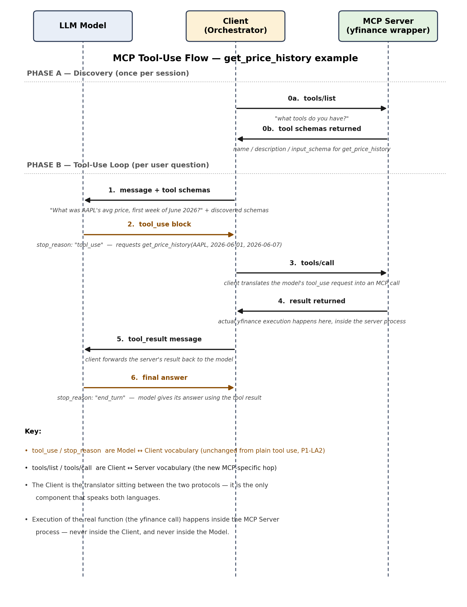

# P1-LA3: MCP (Model Context Protocol)

**Completed:** 2026-07-14
**Track:** AI/Agentic (3rd lesson, 3/17)
**Estimated time:** 2 hours

---

## 1. The problem you already have, without knowing it

In P1-LA2, you built a tool definition — `get_price_history` — as a JSON Schema (JavaScript Object Notation Schema) block that you'd write directly into your Python code, right alongside the API call to the model. That works fine for one tool, in one project, wired to one model.

But think about where Project 1 is actually headed. You need:
- `get_price_history` (yfinance)
- `get_universe_constituents` (NASDAQ-100/S&P 500 list)
- `get_sector_classification` (GICS — Global Industry Classification Standard — sector per ticker)

...and later, Project 2 swaps yfinance for Polygon. And maybe someday you want Claude Desktop (not just your own orchestrator code) to also poke at this same price data, for a quick ad-hoc question, without re-wiring anything.

If every tool is hand-written into whichever specific application needs it, you get what Anthropic calls the **N×M problem**: if you have N applications (your orchestrator, Claude Desktop, some future dashboard) that each want to use M tools/data-sources (yfinance, a sector-mapping file, a database), you potentially need N×M separate bespoke integrations — because each application's code has its own copy of "how to call yfinance," "how to look up sectors," wired directly into it. As the number of applications and tools both grow, the number of required integrations grows multiplicatively, not additively.

### Analogies from your background

**FIX protocol (trading tech):** Before FIX (Financial Information eXchange) protocol existed, every trading desk's system had to build a custom connector to every exchange and every counterparty — N desks × M venues = a combinatorial mess of point-to-point integrations, each one bespoke, each one breaking independently when either side changed something. FIX didn't make any single connection smarter or faster; it standardized the *message format* so any FIX-compliant system could talk to any other FIX-compliant system without a custom one-off build.

**USB-C:** Before USB-C, every device had its own connector (Lightning, micro-USB, proprietary charging pins), so every accessory-maker had to build a version for every device. USB-C didn't change how electricity moves — it standardized the *physical/electrical interface* so one cable works with any USB-C-compliant device. This is the analogy Anthropic itself uses for MCP.

### What MCP is

**Model Context Protocol (MCP)** is Anthropic's answer to the N×M problem for AI tool integration. It's an open standard, released by Anthropic in November 2024 (created by engineers David Soria Parra and Justin Spahr-Summers), that standardizes *how* an AI application talks to external tools and data sources — so instead of N×M bespoke integrations, you get N+M: each application implements the MCP client side once, each tool/data-source implements the MCP server side once, and any client can talk to any server.

As of the most recent information available, MCP has since been adopted well beyond Anthropic — OpenAI, Google DeepMind, and Microsoft all support it — and in December 2025 Anthropic transferred governance of the protocol to a vendor-neutral body (the Agentic AI Foundation, under the Linux Foundation). This means MCP is no longer "Anthropic's protocol" specifically; it's shared infrastructure, in the same category as HTTP or TCP/IP — a standard no single company owns.

---

## 2. Client/server architecture — the core mental model

MCP splits the world into two roles:

| Role | What it is | In Project 1 |
|---|---|---|
| **MCP Server** | A program that *exposes* a set of tools, data, or capabilities, speaking the MCP protocol | Your yfinance wrapper (P1-Build-1): exposes `get_price_history`, `get_universe_constituents`, etc. |
| **MCP Client** | A program that *connects to* one or more MCP servers and uses what they expose | Your orchestrator agent (P1-Build-7) — the thing with the LLM in it that decides which tool to call |

There's a third term worth having in your vocabulary: the **MCP host** is the actual application a person is using (e.g., Claude Desktop, Claude Code, or your own Streamlit app) — it contains the MCP client logic and is what the user directly interacts with. In casual conversation, "client" and "host" often get used interchangeably. For Project 1's purposes, your orchestrator *is* both the host and the client.

### The key design property this buys you

The server and the client don't need to know anything about each other's internals — they only need to agree on the protocol. Your yfinance MCP server doesn't know or care whether it's being called by your custom orchestrator, by Claude Desktop, or by some other agent you build in Project 3. Your orchestrator doesn't need to know *how* `get_price_history` fetches data internally (yfinance today, Polygon in Project 2 (P2)) — it just needs to know the tool's name, description, and input schema, exactly like in P1-LA2.

This is precisely why MCP and Project 2's data-source switch (yfinance → Polygon) sit well together: if both are exposed as MCP servers with the same tool names/schemas, your orchestrator code in Project 2 barely needs to change — you're swapping which server answers the same standardized questions, not rewriting the orchestrator's reasoning logic.

---

## 3. What's actually inside an MCP server — the three primitives

An MCP server can expose three kinds of things to a client:

| Primitive | What it is | Analogy | Project 1 example |
|---|---|---|---|
| **Tools** | Callable functions the model can invoke, with side effects or computation — identical in shape to the tool definitions from P1-LA2 (name, description, input_schema) | An action you can *take* | `get_price_history(ticker, start_date, end_date)` |
| **Resources** | Read-only data the client can pull in as context — files, records, datasets — without it being a "function call" the model reasons about invoking | A document you can *read* | A cached CSV of NASDAQ-100 constituents, exposed as a readable resource rather than requiring a fresh tool call every time |
| **Prompts** | Reusable, pre-written prompt templates the server provides, so common request patterns don't need to be reinvented by every client | A form letter template | Less central to Project 1 — more relevant to servers meant for broad reuse across many different consuming applications |

For P1-Build-1, you'll mainly be building **Tools** — this is the primitive that maps directly onto everything you learned in P1-LA2. The tool-use mechanics (the model deciding to call something, the five-step request/response cycle, `stop_reason`) don't change at all under MCP. What changes is *where the tool definitions live and how the call actually gets executed* — that's the part MCP standardizes.

---

## 4. Worked example: `get_price_history` through MCP, step by step

In P1-LA2, the five-step cycle assumed the tool definition and the tool's actual Python code both just lived in your one application. Here's that exact example re-run, but now `get_price_history` lives inside a separate MCP server, and your orchestrator is an MCP client talking to it.

### Step 0 (new, vs. P1-LA2) — Discovery

Before the client can even offer tools to the model, it has to find out what the server has. The client sends a `list_tools`-style request to the MCP server over the connection; the server responds with the tool schemas it exposes — the exact same shape you built by hand in P1-LA2 (name, description, input_schema), except now the *server* authored and owns that schema, not your application code.

```json
// Client → Server
{ "method": "tools/list" }

// Server → Client
{
  "tools": [
    {
      "name": "get_price_history",
      "description": "Fetch adjusted-close daily price history for a ticker over a date range.",
      "input_schema": {
        "type": "object",
        "properties": {
          "ticker": {"type": "string"},
          "start_date": {"type": "string"},
          "end_date": {"type": "string"}
        },
        "required": ["ticker", "start_date", "end_date"]
      }
    }
  ]
}
```

### Steps 1-2 (same as P1-LA2)

The client passes these discovered tool schemas to the model, alongside the user's question ("What was AAPL's average price in the first week of June 2026?"). The model returns a `tool_use` block requesting `get_price_history` with specific inputs — mechanically identical to P1-LA2. This is still the model doing probabilistic next-token-style reasoning about which tool fits, exactly as covered in the prior lesson; MCP changes nothing about this step.

### Step 3 (different from P1-LA2) — Execution now happens inside the MCP server

The client doesn't run `yfinance.download(...)` itself; it sends an MCP `tools/call` request across the client-server connection, and the server — a separate process — is the one that actually runs the yfinance call:

```json
// Client → Server
{ "method": "tools/call", "params": {
    "name": "get_price_history",
    "arguments": {"ticker": "AAPL", "start_date": "2026-06-01", "end_date": "2026-06-07"}
}}

// Server → Client
{ "result": {"content": [{"type": "text", "text": "2026-06-01: $201.34\n2026-06-02: $203.10\n..."}]}}
```

Note the output format again follows the P1-LA2 principle: human-readable, labeled text (`"2026-06-01: $201.34"`) rather than opaque unlabeled JSON, since the model benefits from clearly-labeled results the same way regardless of which layer executed the call.

### Steps 4-5 (same as P1-LA2)

The client forwards this result to the model as a `tool_result`, and the model gives its final text answer or requests another call, exactly as in the P1-LA2 five-step cycle.

### The takeaway from this walkthrough

**Nothing about tool-use reasoning changed.** What changed is that Steps 0 and 3 — discovery and execution — now happen across a standardized client-server boundary instead of being baked directly into one codebase. That boundary is what lets the yfinance server be reused, swapped, or shared without touching the orchestrator's reasoning logic at all.

### Flow diagram — and a clarification on `stop_reason`

It's easy to read the worked example above and assume MCP replaces or removes `stop_reason` (the field from P1-LA2 that tells the application whether the model is waiting on a tool result or has finished). **It doesn't.** MCP adds a new hop *after* that signal — it doesn't touch the signal itself.

The clean way to see this: `tool_use` and `stop_reason` are **Model ↔ Client** vocabulary (unchanged from plain tool use in P1-LA2). `tools/list` and `tools/call` are **Client ↔ Server** vocabulary — the new MCP-specific hop. The Client is the only component that speaks both languages; it translates between them. Concretely:

1. Client → Model: message + tool schemas
2. Model → Client: `tool_use` block, **`stop_reason: "tool_use"`**
3. Client → MCP Server: `tools/call` (the client translates the model's request into an MCP call)
4. MCP Server → Client: result (actual yfinance execution happens here)
5. Client → Model: `tool_result` message
6. Model → Client: final answer, **`stop_reason: "end_turn"`**



*Figure: the full MCP flow for `get_price_history`, split into Phase A (Discovery — happens once per session) and Phase B (the Tool-Use Loop — happens per user question). Note that `tool_use`/`stop_reason` only ever appear on the Model↔Client lifeline, while `tools/list`/`tools/call` only ever appear on the Client↔Server lifeline.*


## 5. Transport: how the client and server actually talk

The messages above ride on top of **JSON-RPC** (JavaScript Object Notation - Remote Procedure Call), a lightweight standard for structured request/response messages. You don't need its internal details — just that it's the common "envelope format" MCP uses for every message. JSON-RPC still needs to physically travel somewhere, and MCP supports two main transports:

| Transport | How it works | When it's used |
|---|---|---|
| **stdio** (standard input/output) | The client spawns the MCP server as a local subprocess on the same machine and communicates by writing to/reading from that process's input/output streams | Local servers — a tool running on your own laptop, like a yfinance wrapper for P1-Build-1. Security boundary = your own machine's permissions; no network exposure. |
| **HTTP-based (remote)** | The server runs elsewhere (a hosted endpoint) and the client connects over the network, typically authenticating via OAuth (Open Authorization) | Remote/shared servers — e.g., a company-wide Slack or Google Drive MCP server that many different people's clients connect to |

### Decision for P1-Build-1: local stdio transport

You're running this on your own WSL2 (Windows Subsystem for Linux 2) environment, wrapping yfinance for your own orchestrator's use — there's no reason to stand up a network-accessible server for a personal learning project, and stdio keeps the security model simple (whatever permissions your own user account has, the server has — no separate auth layer to design yet).

This is also the same mechanism the Claude chat interface itself uses today for integrations like Google Drive or Gmail (visible in this very conversation's available tools) — those are MCP servers Anthropic hosts, and the chat client connects to them exactly like your orchestrator will connect to your yfinance server, just over the remote/HTTP transport instead of stdio.

---

## 6. MCP vs. bespoke integration — direct comparison

| Dimension | Bespoke integration (P1-LA2-style, hardcoded) | MCP server |
|---|---|---|
| Where the tool's code lives | Directly inside the one application that uses it | In a separate, independently-runnable server process |
| Reusability across apps | None — every app duplicates the integration | One server, usable by any MCP-compliant client (your orchestrator, Claude Desktop, a future project) |
| Swapping the underlying data source (yfinance → Polygon) | Requires editing the calling application's code | Requires editing only the server; client is unaffected if tool names/schemas stay stable |
| Tool discovery | Manually written into the API call every time | Client dynamically asks the server "what tools do you have" (`tools/list`) |
| Failure isolation | A bug in the integration can crash/corrupt the main application | Server runs as a separate process — a crash there is more contained |
| Effort to add a new tool consumer | New bespoke integration per consumer (N×M scaling) | Consumer just becomes another client of the existing server (N+M scaling) |

---

## 7. Why this specifically matters for P1-Build-1

Three concrete, carried-forward implications for when you actually build the data ingestion module:

1. **Build the yfinance wrapper as an MCP server from the start**, not as a plain Python module imported directly by the orchestrator. This was already locked as a decision back on 2026-07-11 ("MCP and Claude Agent SDK are in scope from Project 1"); this lesson is the "why" behind that decision, not a new one.
2. **Tool descriptions are now a server-authoring responsibility**, and the P1-LA2 lesson on writing rigorous `description` fields applies with even more force — the server is the sole source of truth for what the tool does, since the client has no other way to learn about it except by asking (`tools/list`).
3. **Local stdio transport** is the right choice for now, since this is a personal-machine learning project with no need for remote hosting yet. Worth flagging: Project 1's eventual deployment step (P1-Build-12) moves the *orchestrator* to a hosted endpoint (AWS Bedrock) — that's a separate question from whether the MCP server itself needs to be remote. Revisit the MCP server's transport choice at that point if the deployment architecture requires it (e.g., if the hosted orchestrator can no longer spawn a local subprocess on your laptop).

---

## 8. Security preview (full depth deferred to P1-LA10)

One thing worth planting now, since it will matter directly once you're actually running an MCP server: **an MCP server runs with whatever permissions the process it's spawned in has.** For a local stdio server on your own machine, that's your own user account's permissions — meaning if your yfinance server had, hypothetically, filesystem write access it didn't need, a malicious or buggy tool call could act on that.

The general principle (full treatment in P1-LA10, Agent security & adversarial failure modes) is **least-privilege scoping**: an MCP server should only be able to do the narrow thing it's meant for, not carry broader access "just in case." For P1-Build-1, this means the server should only need read access to price/universe data and write access to its own cache directory — nothing more. This is a design point to carry into P1-Build-1's implementation, not something to solve now.

---

## Summary: what this lesson locked vs. what it didn't

**No new pipeline design decisions were locked in this lesson** — this is an architecture/protocol-mechanics lesson, not a finance or portfolio-construction decision point. What it does do is provide the vocabulary and mental model for how P1-Build-1 (the MCP data server) and P1-Build-7 (the orchestrator, as an MCP client) will actually communicate — directly informing the implementation approach for both build sprints.

**Carried-forward action items surfaced this lesson:**
- P1-Build-1: implement the yfinance wrapper as an MCP server (not a bespoke Python module), using local stdio transport, exposing `get_price_history`, `get_universe_constituents`, and `get_sector_classification` as Tools.
- P1-Build-1: apply least-privilege scoping to the server's own permissions (read access to price/universe data, write access only to its own cache directory) — full depth on why in P1-LA10.
- P1-Build-7 (orchestrator): implement as an MCP client — must perform tool discovery (`tools/list`) against the P1-Build-1 server rather than hardcoding tool schemas directly into the orchestrator's code.
- P1-LA10 (later lesson): revisit least-privilege/permission-scoping for MCP servers in full depth, including the "prefer deterministic access controls over prompted instructions not to call a tool" principle already previewed in curriculum.md's LA10 description.

**Follow-up clarification (2026-07-14, same session): does MCP remove `stop_reason`?** No — this was a legitimate ambiguity in the original worked example, since it didn't show `stop_reason` explicitly. Resolved: `stop_reason` and `tool_use` remain Model↔Client vocabulary, entirely unchanged from P1-LA2; MCP only adds the Client↔Server hop (`tools/list`/`tools/call`) *after* the model has already signaled `stop_reason: "tool_use"`. The Client is the single component that speaks both protocols and translates between them. See Section 4's flow diagram for the visual reference — this distinction (which vocabulary belongs to which leg of the flow) is worth holding onto heading into P1-LA4 (structured outputs), since schema validation will apply on both legs but for different purposes.
